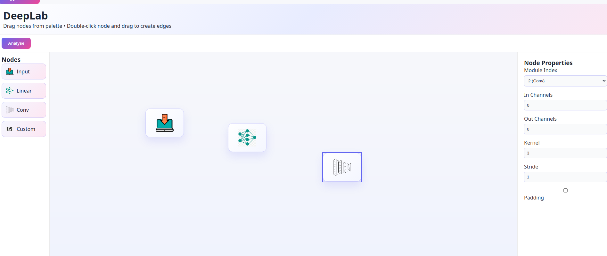

# DeepLab
A visual, drag-and-drop tool to design, connect, and train machine learning models directly through an interactive node-based interface.
Clone the repo run the main.py file 
requirmnets: python 3.10.9
Just like Canva user will create Modules like Linear Layers,Conv layers,Attention to create The Deep Learning Models by connecting them using Edges. We have Diffrent kind of Dataset Connectors and Trainers support to Train diffrent Patterns of Problem That Deep Learning Community Faces 
## GUI Preview

